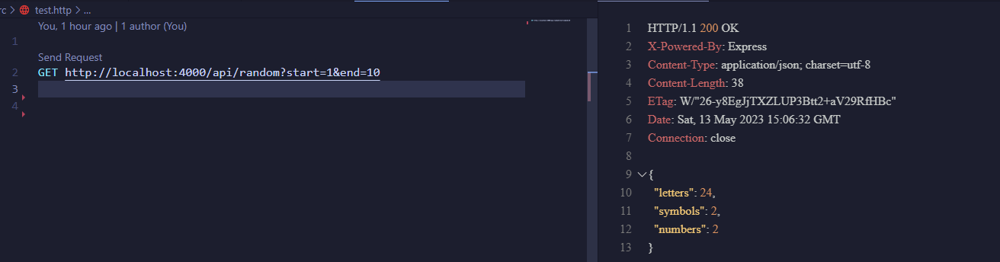
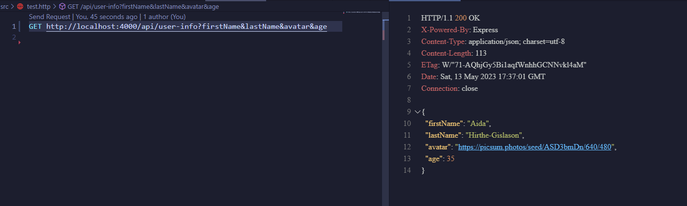
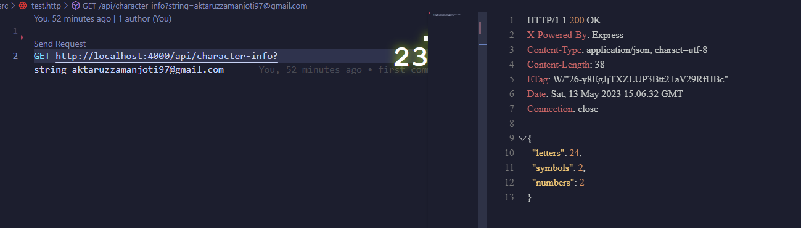

# Full Stack Army (Advance Backend)

## Assignment - 01 (Make algorithm live using REST API) 📝

### Task - 01 📝

We have a function that can take two arguments called start and end. Both arguments will be a valid integer number. The function will return a random value in the given range.

#### Solution - 01 📚

- Business Logic Link: [getRandomNumber](./src/businessLogic/randomNumber.js)
- Output

### Task - 02 📝

We have a function that can generate a fake person profile including first name, last name, email, avatar, age and address. User can pass an array of selected properties and it will return a person object containing only given properties. Ex: generatePerson([’firstName’, ‘lastName’, ‘email’]).

#### Solution - 02 📚

- Business Logic Link: [getPersonProfile](./src/businessLogic/personProfile.js)
- Output

### Task - 03 📝

We have a function that can accept a string as an argument and return an object containing the number of letters, number of symbols and number of numeric characters.

#### Solution - 03 📚

- Business Logic Link: [breakdownString](./src/businessLogic/characterInfo.js)
- Output

### API Logic Link 🔗

[API Logic](./src/app.js)

#### Prepared By 🙋‍♂️

[Aktaruzzaman Joti](https://www.linkedin.com/in/aktaruzzaman-joti/)
